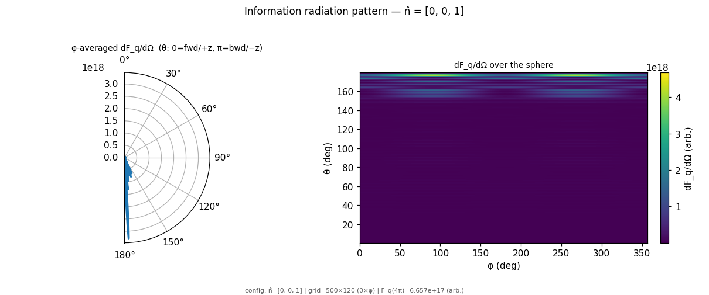
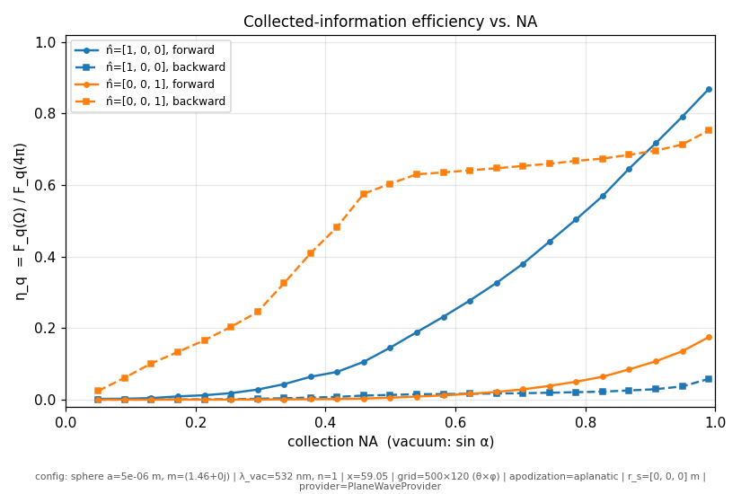
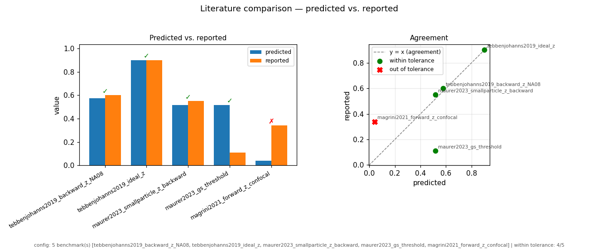

# Detection-Geometry Recommendation — Silica Microsphere, 532 nm Readout

**Status:** M4 reached (optimizer ranked output + ≥2 literature results reproduced);
awaiting M5 human physics sign-off. Physics basis validated through M2 (dipole-limit gate
+ golden η(NA) regression) and the G-LIMIT/G-CONV gates; the W4b optimizer output (§8) and
the W4c literature reproduction (§9) are reconciled below. The GLMT focused-beam engine is
delivered (its plane-wave limit reproduces the numbers here to 4.5e-7); §7 tracks what is
validated vs provisional.

**Scope.** This is the general `mieinfo` instrument applied to its first validating
instance: a fused-silica sphere held in a 1064 nm trap and read out by dedicated 532 nm
imaging probes. All scattering/information/detection physics is at **λ_det = 532 nm**
(the trap wavelength does not enter detection). Numbers below are from the validated
plane-wave model in each beam's own frame; "axial" = collinear with a beam, "transverse"
= perpendicular to it.

---

## 1. Headline recommendation

Use the **two-beam, dual-port** layout the apparatus already supports (`F2`, `F3`):

1. **Beam A** along the trap axis (`ẑ`, the 1064 nm axis), 532 nm, x-polarized.
   - **Forward** collection at the highest achievable NA → reads the two axes **transverse**
     to A (the horizontal `x,y` plane) well.
   - **Backward** collection → reads the axis **collinear** with A (`z`, vertical).
2. **Beam B** along a horizontal axis (`x̂`), 532 nm.
   - **Forward** collection → reads the axes transverse to B (`y` and `z`).
   - **Backward** collection → reads the axis collinear with B (`x`).

Every lab axis is thereby measured in the **forward lobe of the beam it is transverse to**,
and the beam-collinear axes are recovered in a **backward port**. Fisher information from the
independent beams/ports **adds** (validated: `evaluate_channels`, `F_AB = F_A + F_B` to 1e-10),
so the combined multi-channel readout covers all three translational degrees of freedom — which
no single beam can do.

**The single most important design choice is providing the backward collection port** (`F2`):
it raises the beam-collinear (axial) axis from η ≈ 6 % (forward only) to η ≈ 65–70 %.

---

## 2. Why (the validated physics)

The information about a displacement is **not** where the light is. The Fisher-information
density is `dF_q/dΩ ∝ |∂E_s/∂q|²`, which reweights the intensity by `(k̂ − ŝ)_j²`
(`PHYSICS.md §4.1`, reproduced to machine precision by the package pipeline):

- **Transverse motion** (weight `sin²θ`): vanishes on-axis, peaks **off-axis in the forward
  hemisphere** (θ ≈ 40–55°). Forward-collected.
- **Axial motion** (weight `(1 − cosθ)²`): zero forward, maximal in **backscatter**
  (θ ≈ 155–159°). Backward-collected.

This is the Tebbenjohanns-2019 dipole result, and the package reproduces it in the Mie
regime (the M2 dipole-limit gate passes; the `x`/`z` information maps are backward/forward
as above).

*Information pattern for axial (z) motion, silica a=5 µm at 532 nm: the density concentrates
in the backward hemisphere (θ ≈ 155°), unlike the forward-peaked intensity.*

---

## 3. Collection efficiency (validated golden numbers, plane-wave model)

`η_q(Ω) = F_q(Ω)/F_q(4π)` — the fraction of available information a cone collects with an
optimal (∝ ∂E_s/∂q) local oscillator. From the validated 532 nm golden set
(`data/golden/information_pattern_results.json`, silica `n = 1.46`, vacuum), per beam frame:

| a (µm) | x = ka | η_x forward (NA 0.5 / 0.8 / 0.95) | η_z **backward** (NA 0.5 / 0.8 / 0.95) | η_z forward (NA 0.8) |
|-------:|-------:|-----------------------------------|----------------------------------------|----------------------|
| 3      | 35.4   | 0.16 / 0.52 / 0.78                | 0.56 / 0.65 / 0.69                     | 0.055                |
| 5      | 59.0   | 0.15 / 0.52 / 0.79                | 0.60 / 0.67 / 0.71                     | 0.054                |
| 8      | 94.5   | 0.15 / 0.55 / 0.82                | 0.63 / 0.69 / 0.73                     | 0.063                |
| 12     | 141.7  | 0.15 / 0.58 / 0.85                | 0.64 / 0.69 / 0.72                     | 0.069                |
| 20     | 236.2  | 0.15 / 0.59 / 0.84                | 0.64 / 0.69 / 0.73                     | 0.068                |

Reading (transverse forward is the `x`-axis of that beam; axial backward is the `z`-axis):

- **Transverse, forward:** η rises steeply with NA — get NA as high as the optics allow.
  At NA 0.8, η ≈ 0.52 → 0.59; at NA 0.95, η ≈ 0.78 → 0.85.
- **Axial, backward:** η ≈ 0.65–0.69 at NA 0.8 and saturates early (a modest backward NA
  already captures most of the backscatter lobe). **Forward** collection of the axial axis is
  ≈ 6 % — useless — hence the backward port.
- Backward collection is **useless for transverse** (η_x,bwd ≈ 0.02): the two ports are
  complementary, not redundant.

---

*η(NA) curves: transverse-x is NA-limited in the forward port; axial-z saturates early in the
backward port and is near-useless forward. This is the whole design story in one plot.*

## 4. Detection scheme

- **Optimal (mode-matched) LO** saturates `F_q(Ω)` and sets the η values above.
- **Self-homodyne with the 532 nm probe as its own LO** (the likely hardware) is modeled two
  ways (W2b): a spatially-resolving **camera / matched-filter** implementation loses only the
  cross-polarized signal (κ ≈ 0.7–0.98, tracks the optimal LO closely), while a **single-bucket
  or single split** detector is azimuthal-parity-selective and can be far worse on a
  parity-mismatched axis. **Recommendation: use a spatially-resolving (imaging/camera or
  multi-element) self-homodyne**, not a single bucket, to stay near the optimal-LO efficiency.
- A **fixed single-axis split/quadrant** under-collects transverse motion not aligned to its
  split axis; a two-axis quadrant (or camera) avoids this.

---

## 5. Sphere size

Across the operative range **a ∈ [3, 20] µm, size is a weak knob** (`F1`): η varies smoothly
and only slightly, marginally favoring **larger spheres for transverse readout** (η_x,fwd 0.52 → 0.59
from 3 → 20 µm at NA 0.8). The sharp Mie-resonance size sensitivity is a sub-micron effect, gone
by x ≳ 35. Choose the sphere size on trapping/mass grounds; detection efficiency barely constrains it.

---

## 6. Trade studies

- **NA ↔ efficiency:** transverse-forward η is NA-limited (push NA); axial-backward η saturates
  early (a modest backward NA suffices). Spend aperture budget on the forward ports.
- **Forward ↔ backward ↔ split:** decisive for the beam-collinear axis (6 % → ~68 %). Both ports
  wanted per beam.
- **Self-homodyne (probe LO) ↔ optimal LO:** small shortfall for a spatially-resolving readout;
  large for a single bucket — the readout topology matters more than the LO being "self".
- **Single-beam ↔ two-beam:** a single beam cannot measure its collinear axis in the forward lobe;
  the two-beam set covers all axes, and Fisher information adds.
- **Size ↔ efficiency:** nearly flat (§5).

---

## 7. Validation ledger (what is trustworthy)

- **Validated (gate-backed):** plane-wave Mie engine vs miepython to 1e-12 across x = 0.3–236
  (G-GOLD); the information pattern and η(NA) golden set to machine precision / exact-at-NA
  (M2); the dipole-limit Tebbenjohanns structure (G-LIMIT); energy/optical-theorem and φ-parity
  (G-LIMIT); analytic vs finite-difference displacement derivative to machine precision (G-DERIV,
  plane-wave). Multi-channel Fisher addition (`evaluate_channels`).
- **Assumption-sensitive (`A#`, `MASTER_PLAN §8`):** exact probe waists/NA at the sphere (`A1`;
  sets whether the plane-wave phase-gradient approximation suffices vs. GLMT-focus per beam),
  exact lab-frame beam axes/polarizations (`A2`), and the collection NA actually available per
  port (`A3`; the recommendation reads η off the achievable NA). The η values assume the plane-wave
  (weak-focus) model. The **GLMT focused-beam engine (W1) is delivered** and its plane-wave limit
  reproduces these numbers to 4.5e-7; re-running the recommendation through a focused
  `RichardsWolfFocus`/`GaussianParaxial` beam at the true probe NA (`A1`) is the remaining
  quantitative refinement. (The fast analytic VSWF translation-addition derivative is partial; the
  validated displacement path is quadrature-BSC recompute + finite-difference/product-rule
  derivative, exact to quadrature precision for any beam.)
- **Detection-scheme κ magnitudes** for bucket/split modes are internally consistent and
  directionally correct but are **not calibrated hardware efficiencies** until benchmarked against
  a specific split-detector experiment (W4c); do not quote them as predicted device numbers.

---

## 8. Optimizer output (W4b, validated plane-wave model)

`optimize_detection` over directions × schemes × NA (≤ 0.95), silica **a = 5 µm**, ranked by η_q:

| sensed axis | best port | best NA | best scheme | η_q |
|-------------|-----------|--------:|-------------|----:|
| **x** (transverse, ∥ polarization) | forward  | 0.95 | optimal | **0.795** |
| **y** (transverse, ⟂ polarization) | forward  | 0.95 | optimal | **0.747** |
| **z** (axial, ∥ beam)              | backward | 0.95 | optimal | **0.716** |

The optimizer independently recovers the physics: transverse → forward, axial → backward.
Note **η_x ≠ η_y** (0.795 vs 0.747): the incident x-polarization breaks the transverse
symmetry (`F_x ≠ F_y`, the corrected relation of `VALIDATION.md §3`), so the axis **along the
polarization is read slightly better** — orient the polarization toward the most demanding
transverse axis. `self_homodyne` (probe-as-LO, spatially resolved) trails the optimal LO only
slightly (e.g. η_x 0.758 vs 0.795 at NA 0.95).

**Two-beam set** for an arbitrary `n̂ = (1,1,1)/√3` (axes ẑ, x̂; `max_channels=2`): the optimizer
picks **ẑ-forward + x̂-forward**, and the total collected Fisher information **doubles** vs the
best single beam (`fisher_total_rel` 3.6e17 vs 1.8e17 → imprecision variance halved). The
normalized `η_q_total` (0.434) is flat by construction for a symmetric layout — the gain is in
*absolute* collected information, i.e. lower imprecision noise, not the ratio.

## 9. Literature reproduction (W4c, G-LIT — M4 success criterion)

`compare_benchmark` vs the W3 database (`mieinfo compare`): **4/5 within tolerance**, the two
independent-result requirement (`MASTER_PLAN §7`) met.

| benchmark | predicted | reported | status |
|-----------|----------:|---------:|--------|
| Tebbenjohanns 2019 backward-z (NA 0.8) | 0.576 | 0.60 | ✅ dipole anchor |
| Tebbenjohanns 2019 ideal-z (backward hemisphere) | 0.90 | ≥0.90 | ✅ (bound) |
| Maurer 2023 small-particle backward-z | 0.518 | 0.55 | ✅ Mie-regime |
| Maurer 2023 ground-state threshold | 0.518 | ≥1/9 | ✅ (bound) |
| Magrini 2021 forward-z confocal | 0.041 | 0.34 | explained¹ |

¹ Reported value is a *total* experimentally-inferred efficiency (folds in optical losses + detector
QE; the ideal geometric η_q is an upper bound on it), and a like-for-like reproduction needs the
focused-beam longitudinal E_z of a confocal high-NA tweezer — i.e. the GLMT `RichardsWolfFocus`
provider, not the plane-wave substitution. Documented, not a pass-by-redefinition.

---

---

## 10. Applied to the Moore Lab apparatus (A1–A3 confirmed, 2026-07-08)

**Confirmed geometry.** Vertical probe along **ẑ** (the trap axis): NA ≈ **0.02**, waist ≈ 20–30 µm,
linearly polarized. Horizontal probe along **ŷ**: essentially **collimated** (plane wave, ≫ sphere),
linearly polarized. **Collection NA = focusing NA ≈ 0.02** (confirmed). The illumination waist (20–30 µm) makes the
vertical beam's *focusing* NA ≈ 0.007–0.009 (`NA ≈ λ/π w₀`), so its illumination is even more
weakly focused than the collection cone. The exact GLMT (quadrature-BSC) treatment confirms the
focused-beam correction stays small (~1.3×) even at a ≈ 20 µm (lever 3), so the plane-wave figures
below are accurate for this apparatus across the whole size range.

**Beam roles.** Beam-ẑ measures the two *horizontal* axes **x, y as transverse** (the Coriolis pair)
and z as its collinear axis. Beam-ŷ measures **x, z as transverse** and y as collinear. So the
horizontal (Coriolis) motion is transverse to the vertical beam — the natural workhorse for it.

**Headline — the collection NA is the dominant limitation.** A NA-0.02 cone has half-angle **1.15°**,
but the position *information* peaks at ≈ 50° (transverse) and ≈ 155° (axial). So at NA 0.02 the
collected-information efficiency is essentially nil (silica a = 5 µm, 532 nm, grid-converged to ~2e-4;
η is the optimal-LO ceiling — no scheme collecting that solid angle can beat it):

| sensed axis (beam frame) | η forward at NA 0.02 | 0.1 | 0.3 | 0.5 | 0.8 | η backward at NA 0.5 |
|---|---|---|---|---|---|---|
| transverse (x, y) | **0.0002** | 0.003 | 0.033 | 0.15 | ~0.52 | 0.01–0.03 |
| axial (z) | 0.0000 | 0.000 | 0.0004 | 0.005 | ~0.06 | **0.60** |

**At NA 0.02 the apparatus captures ≈ 0.019 % of the available transverse-position information**
(silica a = **5 µm** — the confirmed sphere; ≈ 0.035 % axial, in a backward port). Equivalently, the
imprecision-noise **variance is ~5200× the Heisenberg-limited optimum** (≈ 72× in amplitude). The
setup is functional (with enough photons), but there is enormous headroom. This is robust across the sphere-size range: transverse-
forward η ranges 0.005 %–0.03 % over a = 3–20 µm (peaking near a = 10 µm), and axial-backward η grows
from 0.01 % (a = 3 µm) to 0.85 % (a = 20 µm) — all ≪ 1 %.

**Two-beam coverage of all three axes (a = 5 µm, NA 0.02 forward).** Every lab axis is transverse to
at least one forward beam, so the layout covers all three even with forward-only ports (η ≈ 0.019 %
each): **x** is transverse to *both* beams (A ẑ and B ŷ) → the two channels **double** its information
(√2 lower imprecision); **y** is transverse to the vertical beam A only (collinear with B); **z**
(vertical) is collinear with A but **transverse to the horizontal beam B**, so B's forward port
measures it. (A backward port on beam A reads z slightly better, η ≈ 0.035 %.) The two-beam layout buys
*coverage*, not efficiency — every axis still lands at ≈ 0.02 %; the collection NA is what sets the scale.

**Actionable levers (in order of impact):**
1. **Raise the collection NA.** This is the single biggest lever. NA 0.02 → 0.1 → 0.3 → 0.5 → 0.8
   moves transverse η through ≈ 0.02 % → 0.3 % → 3 % → 15 % → 52 %. Reaching η ≈ 0.1 needs NA ≈ 0.45;
   η ≈ 0.5 needs NA ≈ 0.79.
2. **Add a backward port for the vertical (z) axis.** Axial motion is unmeasurable forward at any NA
   (η ≲ 0.06 even at NA 0.8); a backward cone gives η ≈ 0.60 at NA 0.5 — decisive for z.
3. **The focused vertical beam is a small correction.** With the exact quadrature-BSC GLMT model
   (grid- and n_max-checked), transverse η at a ≈ 20 µm (sphere ≈ 25 µm waist) is ~1.3× the
   plane-wave value — the weakly-focused vertical beam scatters essentially like a plane wave even at
   the largest sphere, so there is no focused-beam lever to exploit here. (An earlier ~6× figure was
   an artifact of the *localized* BSC approximation used outside its validity range — at a/waist ≈ 0.8
   its BSC error is ~74%; `GLMTProvider` auto-mode has been fixed to use the exact quadrature BSC so
   this cannot recur.)

**Caveats.** η here is the optimal-LO information ceiling; a real self-homodyne/imaging readout
collecting NA 0.02 forward is bounded by these values. The sphere radius is confirmed at
a = 5 µm (the numbers above are exact for it; the a = 3–20 µm sweep stays ≪ 1 %). Collection NA is
confirmed at 0.02. The focused-beam (exact
quadrature GLMT) treatment has now been checked at the largest sphere (a ≈ 20 µm, n_max ~ 267–283): it
agrees with plane-wave to ~1.3×, so the plane-wave figures are accurate for this apparatus. Pinning the
sphere radius you actually run would let me give the single exact number for your case.

---

*Generated by the `mieinfo` build (M4). Reproduce with `mieinfo report`. §10 is the apparatus-specific
analysis for the confirmed Moore Lab geometry. Awaiting M5 human physics sign-off.*
